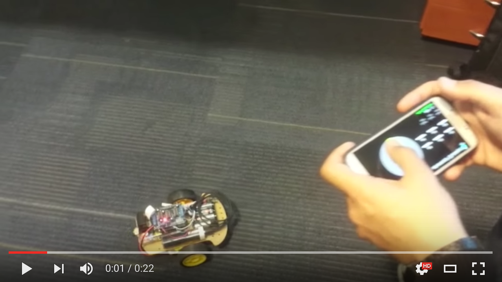

# arduino-car-bt-joystick

This is the Arduino firmware to control a car using a Bluetooth Joystick software like 

## Demo

## App
[Google Play App](https://play.google.com/store/apps/details?id=org.projectproto.btjoystick)
